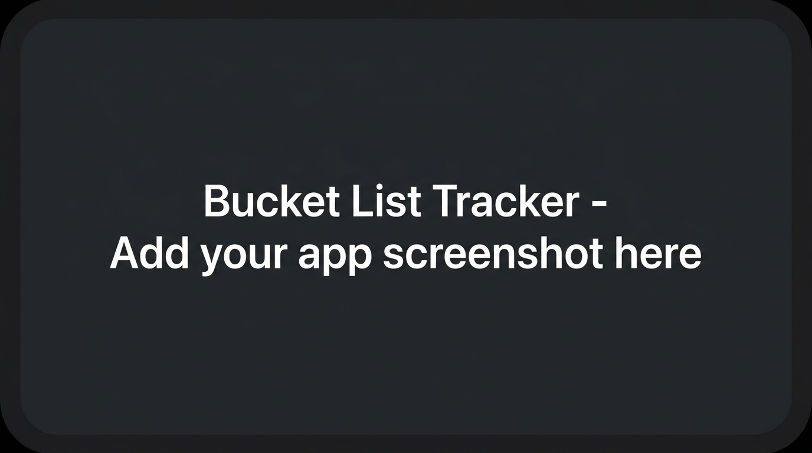

# Bucket List Tracker

An app to track your bucket list goals. You can create goals, move them through dreaming → planning → done, and log experiences as you go. I built it because I wanted a simple way to keep track of life goals and the memories from completing them.

## Getting started

- **Deployed app:** [link]
- **Planning:** https://trello.com/b/eAllWaSa/unit-3-project
- **Back-end repo:** https://github.com/GabrielaZahoranska/Bucket-List-Tracker-Back-end

To run locally: clone both repos, run `npm run dev` in the back-end folder first (port 5001), add a `.env` file here with `VITE_BACK_END_SERVER_URL=http://localhost:5001`, then `npm install` and `npm run dev` in this folder.

## Technologies used

- React
- Vite
- React Router
- CSS (Flexbox and Grid)

## Next steps

- Add photo upload for experiences
- Filter and sort goals by category or status
